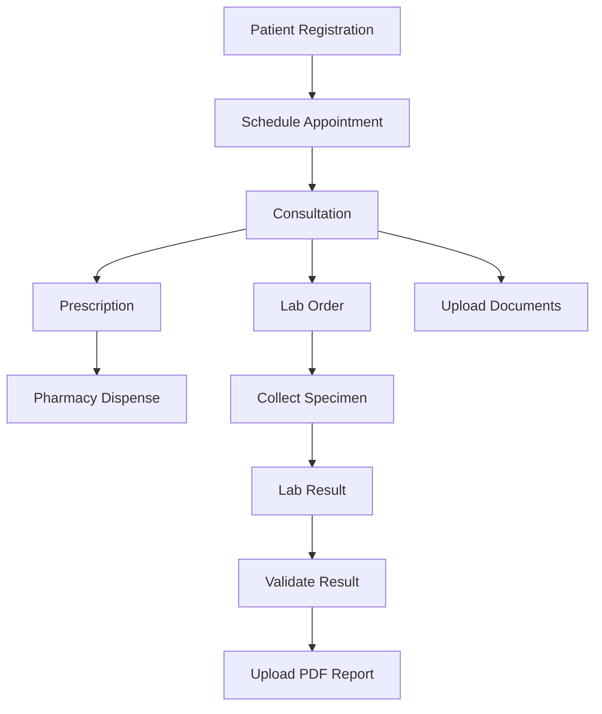

# 🏥 CareFlow-EHR

> **Electronic Health Record (EHR) System - API RESTful complète avec gestion de documents médicaux**

[](https://nodejs.org/)
[](https://expressjs.com/)
[](https://www.mongodb.com/)
[](LICENSE)
[]()

## 📋 Description

**CareFlow-EHR** est un système complet de dossiers médicaux électroniques (Electronic Health Record) avec API RESTful. Il permet la gestion complète des patients, rendez-vous, consultations, ordonnances, laboratoires et documents médicaux avec un système de permissions granulaire.

### 🎯 Fonctionnalités Principales

- ✅ **Authentification JWT** avec refresh tokens
- ✅ **Gestion des Patients** et dossiers médicaux
- ✅ **Rendez-vous médicaux** avec statuts et historique
- ✅ **Consultations médicales** avec signes vitaux et diagnostics
- ✅ **Ordonnances électroniques** avec workflow complet (draft → signed → dispensed)
- ✅ **Gestion des pharmacies** avec géolocalisation
- ✅ **Laboratoire** - Commandes d'analyses et résultats avec PDF
- ✅ **Documents médicaux** - Upload S3, versioning, partage sécurisé
- ✅ **Système de permissions** - RBAC avec 59 permissions et 6 rôles
- ✅ **Audit trail** complet sur tous les modules
- ✅ **Stockage S3/MinIO** pour fichiers et documents

---

## 🚀 Quick Start

### Prérequis

```bash
Node.js >= 18.x
MongoDB >= 8.x
MinIO ou AWS S3 (pour stockage fichiers)
```

### Installation

1. **Cloner le repository**
```bash
git clone https://github.com/mohamedm999/CareFlow-EHR.git
cd CareFlow-EHR
```

2. **Installer les dépendances**
```bash
npm install
```

3. **Configurer les variables d'environnement**
```bash
cp .env.example .env
# Éditer .env avec vos configurations
```

Exemple de fichier `.env` :
```env
# MongoDB
MONGO_URI=mongodb://localhost:27017/careflow_ehr

# JWT
JWT_SECRET=your_super_secret_jwt_key_change_in_production
JWT_EXPIRE=7d

# AWS S3 / MinIO
AWS_ACCESS_KEY_ID=your_minio_access_key
AWS_SECRET_ACCESS_KEY=your_minio_secret_key
AWS_REGION=us-east-1
S3_BUCKET_NAME=careflow-ehr-documents
S3_ENDPOINT=http://localhost:9000    # Pour MinIO local

# Server
PORT=3000
NODE_ENV=development

# SMTP (optionnel)
SMTP_HOST=smtp.gmail.com
SMTP_PORT=587
SMTP_USER=your_email@gmail.com
SMTP_PASSWORD=your_app_password
```

4. **Démarrer le serveur**
```bash
# Mode développement (avec nodemon)
npm run dev

# Mode production
npm start
```

Le serveur démarre sur `http://localhost:3000` 🎉

---

## 📊 Statistiques du Projet

| Métrique              | Valeur      |
|-----------------------|-------------|
| **Total Endpoints**   | 84 REST APIs|
| **Modules**           | 8 modules   |
| **Permissions**       | 59 permissions |
| **Rôles**             | 6 rôles     |
| **Models**            | 8 schemas   |
| **Validations**       | 46 Joi schemas |
| **Lines of Code**     | ~15,000 lignes |

---

## 🗂️ Architecture

### Stack Technologique

```javascript
{
  "runtime": "Node.js 18+",
  "framework": "Express.js 5.x",
  "database": "MongoDB 8.x",
  "odm": "Mongoose 8.19.1",
  "storage": "AWS S3 / MinIO",
  "authentication": "JWT",
  "validation": "Joi 18.0.1",
  "upload": "Multer 2.x",
  "logging": "Winston 3.x",
  "pagination": "mongoose-paginate-v2"
}
```

### Structure du Projet

```
CareFlow-EHR/
├── src/
│   ├── app.js                      # Point d'entrée
│   ├── config/                     # Configuration (DB, Logger, Seed)
│   ├── models/                     # Mongoose schemas (8 modèles)
│   ├── controllers/                # Logique métier (52 fonctions)
│   ├── routes/                     # Endpoints REST (84 APIs)
│   ├── validation/                 # Joi schemas (46 validations)
│   ├── middleware/                 # Auth, Permissions, Validator
│   ├── services/                   # Services externes (Email)
│   └── utils/                      # Utilitaires (JWT, S3)
├── logs/                           # Winston logs
├── test/                           # Tests (à développer)
└── DOCUMENTATION/                  # Documentation complète
```

---

## 🔐 Système de Permissions

### 6 Rôles Utilisateurs

| Rôle | Permissions | Description |
|------|------------|-------------|
| **Admin** | 59 | Accès complet au système |
| **Doctor** | 47 | Consultations, ordonnances, analyses |
| **Nurse** | 32 | Patients, RDV, collecte spécimens |
| **Secretary** | 15 | Gestion administrative |
| **Patient** | 10 | Accès à son propre dossier |
| **Pharmacist** | 4 | Distribution ordonnances |
| **Lab Technician** | 14 | Workflow laboratoire complet |

### 59 Permissions Totales

Réparties en 8 catégories :
- **Patient Records** (9 permissions)
- **Appointments** (10 permissions)
- **Consultations** (7 permissions)
- **Prescriptions** (9 permissions)
- **Pharmacies** (7 permissions)
- **Laboratory** (16 permissions)
- **Documents** (7 permissions)
- **System Management** (4 permissions)

---

## 📡 API Endpoints

### Base URL
```
http://localhost:3000/api
```

### Authentification (5 endpoints)
```http
POST   /auth/register              # Inscription
POST   /auth/login                 # Connexion (JWT)
POST   /auth/refresh-token         # Renouveler token
GET    /auth/me                    # Profil utilisateur
POST   /auth/logout                # Déconnexion
```

### Patients (8 endpoints)
```http
POST   /patients                   # Créer patient
GET    /patients                   # Liste paginée
GET    /patients/stats             # Statistiques
GET    /patients/:id               # Détails
PUT    /patients/:id               # Mise à jour
DELETE /patients/:id               # Suppression
GET    /patients/search            # Recherche avancée
POST   /patients/:id/records       # Ajouter dossier médical
```

### Consultations (9 endpoints)
```http
POST   /consultations                      # Créer consultation
GET    /consultations                      # Liste paginée
GET    /consultations/stats/overview       # Statistiques
GET    /consultations/:id                  # Détails
PUT    /consultations/:id                  # Mise à jour
DELETE /consultations/:id                  # Suppression
GET    /consultations/patient/:patientId   # Consultations patient
GET    /consultations/doctor/:doctorId     # Consultations médecin
POST   /consultations/:id/follow-up        # Consultation de suivi
```

### Prescriptions (13 endpoints)
```http
POST   /prescriptions                      # Créer ordonnance
GET    /prescriptions                      # Liste paginée
PATCH  /prescriptions/:id/sign             # Signer
PATCH  /prescriptions/:id/send             # Envoyer
PATCH  /prescriptions/:id/assign-pharmacy  # Affecter pharmacie
PATCH  /prescriptions/:id/dispense         # Distribuer
# ... et 7 autres endpoints
```

### Laboratory (19 endpoints)
```http
# Lab Orders (9 endpoints)
POST   /lab-orders                       # Créer commande
PATCH  /lab-orders/:id/collect-specimen  # Collecter spécimen
PATCH  /lab-orders/:id/receive-specimen  # Recevoir au labo
PATCH  /lab-orders/:id/status            # Changer statut

# Lab Results (10 endpoints)
POST   /lab-results                      # Créer résultat
POST   /lab-results/:id/upload-report    # Upload PDF (S3)
GET    /lab-results/:id/download-report  # Télécharger PDF
PATCH  /lab-results/:id/validate         # Valider résultat
# ... et 6 autres endpoints
```

### Documents (11 endpoints)
```http
POST   /documents                  # Upload document (S3)
GET    /documents                  # Liste paginée
GET    /documents/:id/download     # URL téléchargement (presigned)
POST   /documents/:id/versions     # Créer nouvelle version
POST   /documents/:id/share        # Partager avec utilisateur
DELETE /documents/:id/share        # Révoquer partage
GET    /documents/:id/access-log   # Logs d'accès
# ... et 4 autres endpoints
```

📖 **Documentation complète**: Voir `DOCUMENTATION/` pour tous les détails

---

## 🧪 Tests

### Tests Postman

Collection Postman disponible dans `src/postamn/CareFlow-EHR-Complete.postman_collection.json`

**Variables de collection à configurer**:
```json
{
  "baseUrl": "http://localhost:3000/api",
  "access_token": "",
  "patient_id": "",
  "consultation_id": "",
  "prescription_id": "",
  "pharmacy_id": "",
  "lab_order_id": "",
  "lab_result_id": "",
  "document_id": ""
}
```

### Tests Automatisés
```bash
# TODO: À implémenter
npm test
```

---

## 🐳 Docker

### Configuration MinIO Locale

```bash
# Démarrer MinIO avec Docker
docker run -d \
  -p 9000:9000 \
  -p 9001:9001 \
  --name minio \
  -e "MINIO_ROOT_USER=minioadmin" \
  -e "MINIO_ROOT_PASSWORD=minioadmin123" \
  minio/minio server /data --console-address ":9001"

# Accéder à MinIO Console
http://localhost:9001
```

### Docker Compose (À venir)

```bash
# Démarrer tous les services
docker-compose up -d

# Services inclus:
# - Node.js API
# - MongoDB
# - MinIO
# - Redis (optionnel)
```

---

## 🔄 Workflows Métier

### Parcours Patient Complet



### Workflow Laboratory

```
ordered → collected → received → in_progress → completed → validated → reported
  ↓         ↓           ↓            ↓            ↓           ↓          ↓
Doctor    Nurse      Lab Tech     Lab Tech     Lab Tech  Supervisor  Patient
```

### Workflow Prescription

```
draft → pending → signed → sent → assigned → dispensed
  ↓        ↓        ↓       ↓        ↓          ↓
Doctor  Doctor   Doctor  System  Secretary  Pharmacist
```

---

## 📚 Documentation

### Fichiers de Documentation

Le dossier `DOCUMENTATION/` contient:

- ✅ `MODULE_CONSULTATION_COMPLETE.md` - Module Consultation
- ✅ `MODULE_PRESCRIPTION_COMPLETE.md` - Module Prescription
- ✅ `MODULE_PHARMACY_COMPLETE.md` - Module Pharmacy
- ✅ `MODULE_LABORATORY_COMPLETE.md` - Module Laboratory
- ✅ `MODULE_DOCUMENT_COMPLETE.md` - Module Document
- ✅ `PART2_ALL_MODULES_COMPLETE.md` - Récapitulatif Part 2
- ✅ `TESTING_DEPLOYMENT_GUIDE.md` - Guide Tests & Déploiement
- ✅ `POSTMAN_PART2_UPDATE.md` - Guide Postman
- ✅ `PROJECT_COMPLETE_STATUS.md` - État complet du projet

---

## 🛠️ Scripts NPM

```bash
# Démarrer en mode développement (avec nodemon)
npm run dev

# Démarrer en mode production
npm start

# Tests (à implémenter)
npm test

# Linter (à ajouter)
npm run lint
```

---

## 🔒 Sécurité

### Mesures de Sécurité Implémentées

- ✅ **JWT Authentication** avec refresh tokens
- ✅ **Bcrypt** pour hashage des mots de passe
- ✅ **Helmet.js** pour sécurité HTTP headers
- ✅ **CORS** configuré
- ✅ **Rate Limiting** (express-rate-limit)
- ✅ **Input Validation** (Joi sur tous les endpoints)
- ✅ **Permission Checks** sur chaque route
- ✅ **Soft Delete** pour traçabilité
- ✅ **Audit Trail** sur documents et résultats
- ✅ **Checksums SHA-256** pour intégrité fichiers
- ✅ **Presigned URLs** temporaires (1h) pour téléchargements

### À Ajouter

- ⏳ **HTTPS** en production
- ⏳ **SQL Injection Prevention** (déjà géré par Mongoose)
- ⏳ **XSS Protection**
- ⏳ **CSRF Tokens**
- ⏳ **Secrets Management** (HashiCorp Vault)

---

## 📊 Monitoring & Logs

### Logs Winston

Les logs sont stockés dans le dossier `logs/`:
- `error.log` - Erreurs uniquement
- `combined.log` - Tous les logs

### Niveaux de Logs

```javascript
{
  error: 0,   // Erreurs critiques
  warn: 1,    // Avertissements
  info: 2,    // Informations générales
  debug: 3    // Debugging (dev only)
}
```

---

## 🤝 Contribution

Ce projet est actuellement privé. Pour contribuer:

1. Créer une branche depuis `main`
2. Faire vos modifications
3. Soumettre une Pull Request
4. Attendre la review

### Conventions de Code

- ✅ ES6+ modules (`import/export`)
- ✅ Async/await (pas de callbacks)
- ✅ Camel case pour variables et fonctions
- ✅ Pascal case pour classes et composants
- ✅ Commentaires JSDoc sur fonctions complexes
- ✅ Validation Joi sur tous les inputs
- ✅ Try-catch sur toutes les async functions

---

## 📝 Changelog

### Version 2.0.0 (2025-01-27) - PART 2 COMPLÈTE

**✅ Ajouts Majeurs**
- ✅ Module Consultation (9 endpoints)
- ✅ Module Prescription (13 endpoints)
- ✅ Module Pharmacy (10 endpoints)
- ✅ Module Laboratory (19 endpoints)
- ✅ Module Document (11 endpoints)
- ✅ Intégration S3/MinIO
- ✅ Système de versioning
- ✅ Système de partage de documents
- ✅ 39 nouvelles permissions
- ✅ Documentation complète

### Version 1.0.0 (Date antérieure) - PART 1 COMPLÈTE

**✅ Features Initiales**
- ✅ Authentification JWT
- ✅ Gestion utilisateurs et rôles
- ✅ Module Patients
- ✅ Module Appointments
- ✅ Système RBAC
- ✅ Validation Joi
- ✅ Logging Winston

---

## 🎯 Roadmap

### Q1 2025
- [x] ✅ Part 1: Authentification & Base
- [x] ✅ Part 2: Modules Métier
- [ ] ⏳ Part 3: Tests Complets
- [ ] ⏳ Part 4: Déploiement Docker

### Q2 2025
- [ ] ⏳ Swagger/OpenAPI Documentation
- [ ] ⏳ Tests Automatisés (Jest)
- [ ] ⏳ CI/CD (GitHub Actions)
- [ ] ⏳ Monitoring (Prometheus + Grafana)

### Q3 2025
- [ ] ⏳ Déploiement Production
- [ ] ⏳ Mobile App Integration
- [ ] ⏳ Analytics Dashboard
- [ ] ⏳ Multi-language Support

---

## 📧 Contact

**Équipe**: CareFlow-EHR Development Team  
**Email**: team@careflow-ehr.com  
**GitHub**: [mohamedm999/CareFlow-EHR](https://github.com/mohamedm999/CareFlow-EHR)

---

## 📄 Licence

Ce projet est sous licence privée. Tous droits réservés.

---

## 🙏 Remerciements

Merci à toute l'équipe de développement pour leur travail acharné sur ce projet ! 🎉

---

**Dernière mise à jour**: 2025-01-27  
**Version**: 2.0.0  
**Status**: ✅ Part 2 Complète - En Tests  
**Prochaine étape**: Tests Postman complets et Configuration Docker/MinIO

---

Made with ❤️ by CareFlow-EHR Team
